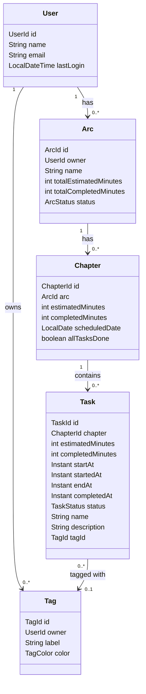

# Domain Overview

FocusArc organizes work sessions in a three-level hierarchy:

**User → Arc → Chapter → Task**

## Enums

| Enum            | Values                                                                       |
|-----------------|------------------------------------------------------------------------------|
| `ArcStatus`     | `ACTIVE`, `COMPLETED`, `ARCHIVED`                                            |
| `ChapterStatus` | `PLANNED`, `COMPLETED`, `SKIPPED`                                            |
| `TaskStatus`    | `PLANNED`, `IN_PROGRESS`, `DONE`, `SKIPPED`                                  |
| `TagColor`      | `RED`, `ORANGE`, `YELLOW`, `GREEN`, `TEAL`, `BLUE`, `PURPLE`, `PINK`, `GRAY` |

## Key Invariants

- A user may have **at most one ACTIVE arc** at a time.
- An arc may have **at most one chapter per date**.
- A task belongs to exactly one chapter and optionally references one tag.